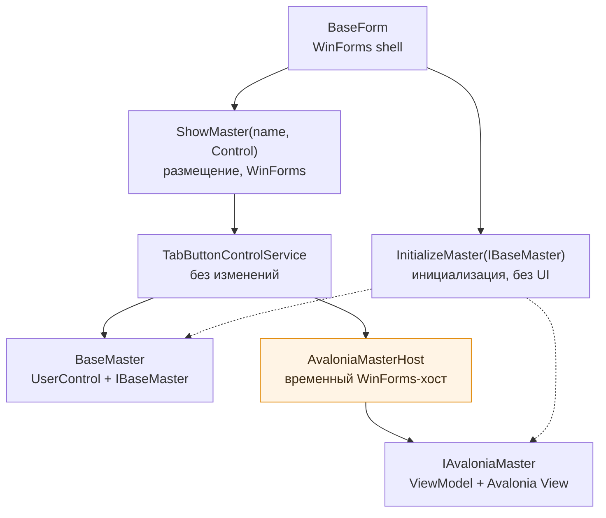

# Поддержка Avalonia-мастеров в BazisGUI

Документ фиксирует решения, принятые при подготовке инфраструктуры для мастеров на Avalonia,
и соответствует текущей реализации в `MasterInterface/Interfaces`, `GUI/AvaloniaUI/Masters`
и `GUI/Methods/Masters`.

## Итоговая схема



## 1. Почему `IBaseMaster` подходит как общий контракт

`IBaseMaster` уже описывает всё, что приложению нужно от мастера: имя, исполнитель команд,
`SendCommandAsync` и события `PrintInfoEvent`, `GenerateConditionsEvent`, `UpdateSceneEvent`,
`OnMasterLoaded`. Ни один член интерфейса не зависит от WinForms, а `HandleBaseMaster`
использует только события — поэтому его сигнатура изменена с `BaseMaster` на `IBaseMaster`
без изменения тела метода. Capability-интерфейсы (`IFunctionsHandling`, `IMaterialsHandling`,
`IGroupHandling`, `IPreparedDataLoader`) от UI тоже не зависят и подключаются проверкой типа.

Отдельный базовый класс `BaseMasterAvalonia` не нужен: он был бы копией `BaseMaster`
с другим предком UI-контрола.

## 2. Что остаётся обязанностью `BaseMaster`

`BaseMaster : UserControl, IBaseMaster` остаётся compatibility-реализацией для существующих
WinForms-мастеров: реализация событий и `SendCommandAsync` плюс роль WinForms-контрола,
который можно положить в область мастеров. Ни один существующий мастер менять не требуется.

## 3. Как разделены initialization и presentation

| Шаг | Метод | Зависит от UI |
| --- | --- | --- |
| Инициализация | `BaseForm.InitializeMaster(IBaseMaster)` | нет |
| Размещение | `BaseForm.ShowMaster(string, Control)` | да, WinForms |
| Закрытие | `BaseForm.CloseMaster(string)` | да, WinForms |

`OpenMaster(BaseMaster)` (legacy) и `OpenMaster(IAvaloniaMaster)` состоят из вызова
`InitializeMaster` и `ShowMaster` и отличаются только тем, что во втором случае представление
оборачивается в `AvaloniaMasterHost`. Общая логика не дублируется.

Контракт Avalonia-мастера — `MasterInterface.Interfaces.IAvaloniaMaster : IBaseMaster`
с единственным членом `Avalonia.Controls.Control CreateView()`. Мастер отдаёт своё представление
и ничего не знает о том, куда его встроят.

## 4. Как реализован embedded Avalonia host

`AvaloniaMasterHost` — наследник `WinFormsAvaloniaControlHost` из пакета
`Avalonia.Win32.Interoperability` (добавлен в `BazisGUI.csproj`, версия 12.1.0 — как у остальных
пакетов Avalonia). Хост создаёт `EmbeddableControlRoot`, делает его дочерним окном
WinForms-контрола и берёт на себя изменение размеров, передачу фокуса, ввод мыши и клавиатуры
и освобождение ресурсов при `Dispose`. Собственный native/interop-слой не потребовался.

Клавиатурный ввод дополнительно требует `WinFormsAvaloniaMessageFilter`: WinForms перехватывает
клавиатурные сообщения раньше Avalonia. Фильтр регистрируется один раз в `AvaloniaHost.Initialize`.

DPI задаёт WinForms: `ApplicationConfiguration.Initialize()` в `Program.Main` выполняется
до инициализации Avalonia, поэтому осведомлённость процесса о DPI одна на всё приложение.

## 5. Используется ли существующий `AvaloniaHost`

Да, `AvaloniaHost` остаётся единственной точкой запуска Avalonia — второй runtime не создаётся,
и на каждый мастер runtime тоже не создаётся. Но его потоковая модель изменена.

Раньше `AvaloniaHost` поднимал отдельный STA-поток и запускал в нём `Dispatcher.UIThread.MainLoop`.
Для отдельных окон это работает, для встраиваемого содержимого — нет:
`WinFormsAvaloniaControlHost` создаёт `EmbeddableControlRoot` в потоке WinForms-контрола, и если
диспетчер Avalonia живёт в другом потоке, дерево не проходит компоновку и отрисовку.
Проверено на отдельном стенде: при раздельных потоках исключения не возникает, но размеры
встроенного содержимого остаются `0 x 0` и на экране ничего нет; при общем потоке те же элементы
получают нормальные размеры и отрисовываются.

Поэтому `Initialize()` теперь настраивает Avalonia в вызывающем потоке — том же UI-потоке WinForms,
из которого он и вызывался в `Program.Main`. Очередь диспетчера Avalonia прокачивает цикл сообщений
WinForms (`Application.Run`), собственный `MainLoop` не запускается. Сигнатура `Initialize`/`Post`
не изменилась, поэтому существующие окна (`ChamferWindowService` и аналогичные) продолжают
работать без правок.

Владельцем `SynchronizationContext` намеренно остаётся WinForms
(`AvaloniaSynchronizationContext.AutoInstall = false`): всё приложение построено на его семантике
маршалинга, а Avalonia обращается к `Dispatcher.UIThread` напрямую.

## 6. Как устроен переход между UI-потоками

Переходов между UI-потоками больше нет: WinForms и Avalonia работают в одном потоке.
Avalonia-мастер вызывает `SendCommandAsync` и поднимает события напрямую, а `BaseForm`
обращается к мастеру напрямую — без `Control.Invoke`, `Task.Run` и промежуточных
`SynchronizationContext`-адаптеров.

Существующие `SynchronizationContext*OperationService` для окон Avalonia остаются рабочими:
`Post` в контекст того же потока просто ставит операцию в очередь.

## 7. Требуются ли изменения `TabButtonControlService`

Нет. Он по-прежнему работает с `System.Windows.Forms.Control`, а Avalonia-представление приходит
к нему завёрнутым в `AvaloniaMasterHost`. Переключение вкладок, скрытие и показ работают так же,
как для WinForms-страниц, потому что дочернее окно Avalonia скрывается вместе с родительским.

Единственное дополнение сделано на стороне `BaseForm`: `CloseMaster` после `RemoveControl`
вызывает `Dispose` у представления — сам `TabButtonControlService` контролы не освобождает.

## 8. Какие новые классы являются временными

| Класс | Назначение | Судьба |
| --- | --- | --- |
| `AvaloniaMasterHost` | размещение Avalonia-представления в WinForms-области мастеров | удаляется после перевода оболочки на Avalonia |
| `IAvaloniaMaster` | контракт «мастер + его Avalonia-представление» | остаётся |
| `InitializeMaster` | подключение мастера к приложению | остаётся |
| `ShowMaster`, `CloseMaster` | размещение и освобождение представления | переписываются под Avalonia-оболочку |

## 9. Что будет удалено после полной миграции GUI на Avalonia

- `AvaloniaMasterHost` и пакет `Avalonia.Win32.Interoperability` вместе с `WinFormsAvaloniaMessageFilter`;
- WinForms-часть размещения (`ShowMaster`, `CloseMaster`, `TabButtonControlService`);
- `BaseMaster : UserControl` — после переноса оставшихся WinForms-мастеров;
- перегрузка `OpenMaster(BaseMaster)`.

Код самих Avalonia-мастеров при этом не меняется: они зависят только от `IAvaloniaMaster`
и `IBaseMaster`.

## 10. Как в будущем расширить `ImportMasterDLL`

Загрузчик не изменялся: он ищет наследников `BaseMaster` и вызывает `OpenMaster(BaseMaster)`.

Всё, что нужно для внешних Avalonia-мастеров, со стороны контрактов уже готово:
`IAvaloniaMaster` лежит в сборке `MasterInterface` рядом с `IBaseMaster`, а сама сборка
получила `PackageReference` на `Avalonia` (версия пакета поднята до 1.1.0). Внешняя DLL может
реализовать интерфейс, ссылаясь только на `MasterInterface`.

В самом загрузчике останется добавить второй проход по типам сборки с проверкой
`typeof(IAvaloniaMaster).IsAssignableFrom(type)` и вызвать `OpenMaster(IAvaloniaMaster)` —
вся инициализация уже общая.

## Известное ограничение

`InitializeMaster` подписывает мастер на события `BaseForm` (`OnProjectLoaded`, `OnChangeMaterials`,
`OnChangeFunctions`, события групп) и нигде их не отписывает. Это существующее поведение,
одинаковое для WinForms- и Avalonia-мастеров: закрытый мастер продолжает удерживаться
подписками до завершения работы приложения. Отдельная задача — ввести отписку
(например, возврат `IDisposable` из `InitializeMaster`).

## Как открыть Avalonia-мастер

```csharp
// открытие: инициализация + размещение в области мастеров
OpenMaster(master);              // master : IAvaloniaMaster

// закрытие: удаление вкладки и освобождение Avalonia-представления
CloseMaster(master.MasterName);
```

Мастер реализует `IAvaloniaMaster`, возвращает своё представление из `CreateView()`
и не ссылается ни на WinForms, ни на `AvaloniaMasterHost`.
