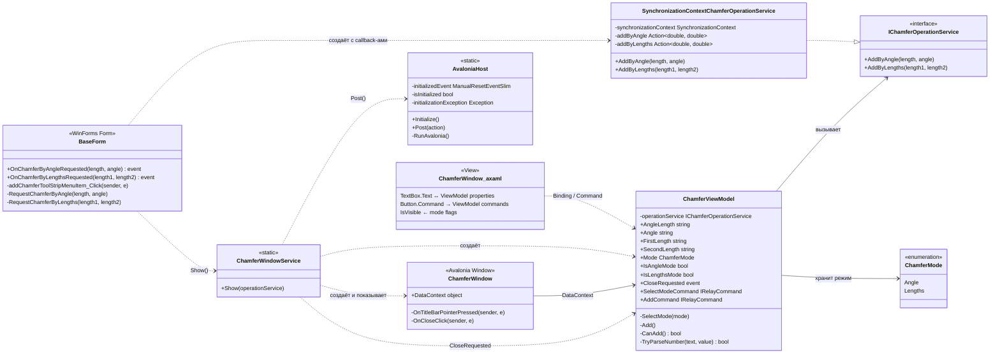

# Диаграмма классов модуля Add Chamfer

Диаграмма соответствует текущей реализации в `GUI/AvaloniaUI/Chamfer`.

## Ответственность классов

- `AvaloniaHost` — единая инициализация Avalonia и диспетчеризация действий на её STA UI-поток.
- `ChamferWindowService` — composition root модуля: создаёт ViewModel и окно, задаёт `DataContext` и связывает запрос закрытия.
- `ChamferViewModel` — состояние полей, выбранный режим, проверка чисел и команды.
- `IChamferOperationService` — граница между Avalonia-модулем и прикладной логикой BazisGUI.
- `SynchronizationContextChamferOperationService` — переходной адаптер, возвращающий запрос на WinForms UI-поток без зависимости от `BaseForm`.
- `ChamferWindow` и `.axaml` — представление и только оконное поведение: отображение, перетаскивание и закрытие.
- `ChamferMode` — внутреннее состояние UI; за пределы Chamfer-модуля не передаётся.

